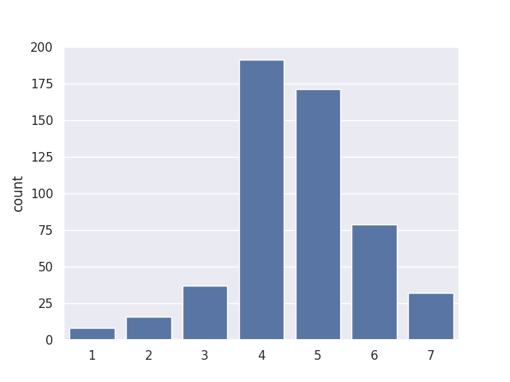
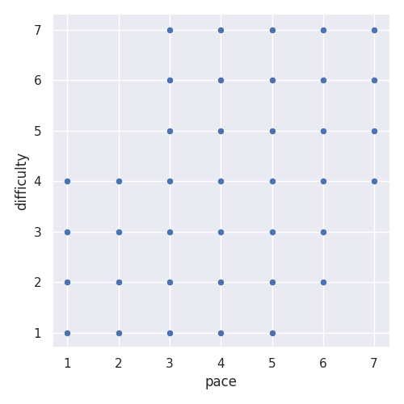

---
# Do not edit the text between these lines!
layout: default
---

# Data Analysis Project

## About Me 
Hi my name is Varsha and this is my data analysis project on whether or not the pacing of the course can impact a students understanding of the material and whether or not there is a correlation between how difficult they find it. 

## What I did
I looked at the pacing ratings given by the students, I then compared pacing and difficulty to see if there was a correlation and after that compared pacing and understanding.

## Findings
I noticed based on the bar graph that the most of the students rated pacing to be around 4 and 5. 
<h2>Graph 1: Pacing Distribution</h2>

After analyzing both of the scatterplots there was no strong correlation between pacing and difficulty, and no strong relationship between pacing and understanding. 
<h2>Graph 2: Pacing vs Difficulty</h2>

<h2>Graph 3: Pacing vs Understanding</h2>

## Conclusion
The data and final graphs illustrate that the pacing of the class alone does not impact student outcomes, although it could play a minor role there are other factors that could play a role. This proves that just adjusting how fast or slow the course moves is not going to improve student learning. Instead, other factors like prior experience and study habits could have a greater influence on student success. Future surveys could explore these additional factors to better understand what most affects student outcomes and how the course could be improved.

<!-- This is a comment. Below, you'll see code for inserting an image. To make this image appear, update <custom-path>. To add an image, save it inside the imgs folder of this repository. -->
